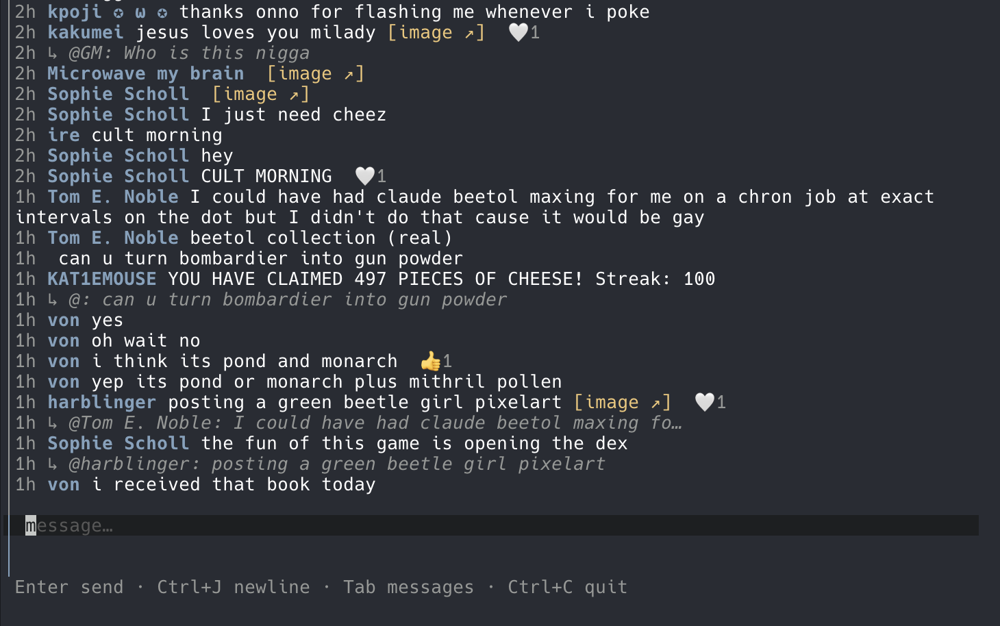
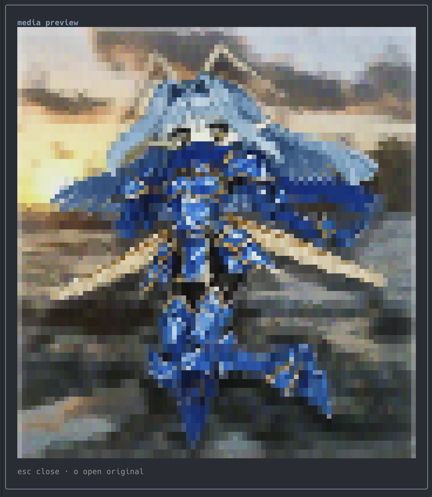

# remiterm

Terminal client for [RemiliaNET](https://www.remilia.net) global chat.

[](https://github.com/tomholford/remiterm/actions/workflows/ci.yml)





Sign in with `remiterm login`, then chat over the public REST API (poll). Replies and reply chains, in-TUI still preview, profiles, poke, and themes. Transport is REST poll only.

## Install

Homebrew (macOS / Linux):

```sh
brew install tomholford/tap/remiterm
```

Binaries for macOS, Linux, and Windows are on [GitHub Releases](https://github.com/tomholford/remiterm/releases). `remiterm --version` prints the release tag.

From source (Go 1.26+, see `go.mod`):

```sh
git clone https://github.com/tomholford/remiterm.git
cd remiterm
./ops/build.sh
```

The binary lands at `./bin/remiterm` (gitignored). `./ops/build.sh` stamps the version from `git describe`.

## Quick start

```sh
remiterm login
remiterm whoami
remiterm
```

`remiterm login` opens a browser. Fallback: `remiterm auth set-token` with a user-delegated `/api/v1` access token — not the browser `authToken` cookie.

Try the TUI with no account and no network:

```sh
remiterm demo
```

From a source build, use `./bin/remiterm` instead.

## Commands

| Command | Description |
| --- | --- |
| `remiterm` | Launch the global-chat TUI |
| `remiterm version` | Print the build version (`--version` also works) |
| `remiterm demo` | TUI against a local fake API (no login, no network) |
| `remiterm login` | OAuth Authorization Code + PKCE (browser + loopback) |
| `remiterm logout` | Clear local tokens |
| `remiterm whoami` | `GET /me` |
| `remiterm auth set-token` | Store an access token (stdin or `--token`) |
| `remiterm auth status` | Show whether a token is stored |
| `remiterm auth clear` | Remove stored tokens |

## Config

Optional YAML at `~/.config/remiterm/config.yaml`:

```yaml
poll_interval: 5s          # 1s–60s
author_label: handle       # handle | display_name | both
timestamp_format: "15:04"  # 15:04 | 15:04:05 | 3:04pm | relative
theme: default             # default | dim | high-contrast | monokai | tomorrow-night | dracula
```

`s` in the TUI settings view writes these prefs. Cycling a value applies it immediately and persists.

| Variable | Meaning |
| --- | --- |
| `REMILIA_ACCESS_TOKEN` | Bearer token (overrides store for this process) |
| `REMITERM_CONFIG` | Path to config file (`REMICHAT_CONFIG` still works) |

Tokens prefer the OS keyring (`service=remiterm`), with fallback to `~/.config/remiterm/tokens.json` (mode `0600`).

Chat history and profile snapshots are cached in SQLite at `$XDG_CACHE_HOME/remiterm/chat.sqlite` (else `~/.cache/remiterm/chat.sqlite`, mode `0600`). The REST API stays the source of truth; the file is a speed/offline layer. Delete it to reset. `remiterm demo` does not write this file.

## Keys (TUI)

Chat (compose / messages):

| Key | Action |
| --- | --- |
| `Enter` | Send (compose) · open detail (messages) |
| `Ctrl+J` | Newline in draft |
| `Tab` | Toggle focus: compose ↔ messages |
| `j`/`k` or arrows | Select / scroll messages |
| `PgUp`/`PgDn` | Page scroll |
| `g`/`G` | Oldest / latest (select + scroll) |
| `r` | Reply to selected message (toggle) |
| `R` | Force refresh (messages focus) |
| `o` | Open selected media / URL in browser |
| `i` | Preview selected still in-terminal |
| `p` | Profile of selected author (messages focus) |
| `m` | Own profile (messages focus) |
| `s` | Settings (messages) |
| `Ctrl+S` | Settings (compose) |
| `Esc` | Cancel reply / back to compose |
| `?` | Help (messages) |
| `Ctrl+G` | Help (compose) |
| `q` | Quit (from messages; closes a modal first if open) |
| `Ctrl+C` | Quit |

Message detail (`Enter` from messages):

| Key | Action |
| --- | --- |
| `j`/`k` | Move along the reply chain |
| `Enter` | Re-root detail on the selected chain item |
| `r` | Reply to selected → compose |
| `o` / `i` / `p` | Open media · preview still · profile |
| `Esc` / `q` | Back to messages (selects the detail focus) |

Settings (`s` from messages, `Ctrl+S` from compose): `j`/`k` select, `Enter`/`h`/`l` cycle, `Esc`/`q` close.

Profile modal: `P` poke (not self; needs `remilia:interact.poke`), `o` open web profile, `Esc`/`q` close.

Media preview (`i`): `o` open original in browser, `Esc`/`q` close.

Media shows as `[image ↗]` (clickable when the terminal supports OSC 8). `i` fetches the thumbnail (else full URL) over plain HTTP — not the OAuth client — and draws Unicode halfblocks via [mosaic](https://github.com/charmbracelet/x/mosaic). GIF first frame; video stays `o`. No Sixel/Kitty detect. `remiterm demo` message 5 has a sample PNG.

Profile read uses public `GET /users/{username}` (no extra scope). Poke uses `POST /users/{handle}/poke`. Own-profile stats use `GET /me/stats` and need `remilia:stats.read`; missing scope hides the section.

## License

MIT. See [CONTRIBUTING.md](CONTRIBUTING.md) for the local gauntlet and [SECURITY.md](SECURITY.md) to report vulnerabilities.
